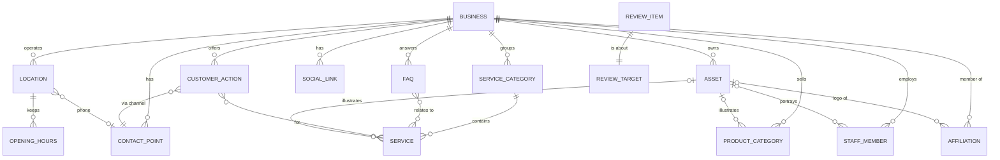

# #businessdata schema and storage

**Status:** draft (design only — code generation deferred pending overall design review)
**Depends on:** 00-architecture

## Goal

Define the fixed schema for #businessdata (profile, contact, locations, hours, services,
products, team, FAQs, affiliations, customer actions, assets) together with an owner
review queue, so that #owners can verify the accuracy of their
data before deploying the #site.

The schema is derived from `digest.xml`, a crawl of an existing small-business website
(Whitby Eye Care). The digest is the reference example for what an initial,
machine-extracted #businessdata looks like before the #owner has reviewed it.

## Scope

- In scope:
  - Entity–relationship model of #businessdata.
  - Pydantic model design (`intelliw.businessdata.schema`).
  - Review items (questions for the #owner).
  - Referential-integrity rules between entities.
- Out of scope (for now):
  - Generating the Python code (deferred).
  - Importer from `digest.xml` into `business.json`.
  - GraphQL / MCP surface over the schema (see 04-mcp-server).
  - How #design templates consume the data (see 02-design).
  - Multi-language content.

## Specification

### Reference scenario: `digest.xml`

Whitby Eye Care ("Dr. R. Fernando & Associates") is an independent optometry clinic at
4091 Thickson Road North, Whitby, ON, serving Durham Region. The digest contains:

| Section  | Content                                                                                          |
| -------- | ------------------------------------------------------------------------------------------------ |
| business | name, legal name, tagline, category, description; logo and favicon                               |
| contact  | main phone, general and appointment emails, external booking URL (Atlas)                         |
| location | one location: address, phone, map URL; weekly opening hours                                      |
| services | 12 services in 6 categories (eye exams, contact lenses, dry eye, eye health, vision correction, eyewear) |
| products | external store URL; 3 product categories (contact lenses, sunglasses, dry-eye relief)            |
| team     | 4 optometrists with role, credentials, bio, optional photo                                       |
| faqs     | 12 question/answer pairs                                                                         |
| social   | Facebook, Instagram, X, Pinterest                                                                |
| trust    | affiliation, certification, milestone, service area, brands, payment methods                     |
| ctas     | Book Appointment (primary), Call Now, Reorder Contact Lenses                                     |
| assets   | 15 images (logo, favicon, hero, photos)                                                          |

Two properties of the digest drive the design:

1. **Every value carries extraction metadata** — `source` (`crawl:<page>` or `inferred`),
   `confidence` (high/medium/low), and optionally `needs-review` with a `note` addressed
   to the #owner. Confidence is rarely below high (1 low, 5 medium, 50 high; many values
   are unrated), and confidence and review are independent: three flagged items are high
   confidence but need an owner decision. The digest raises 8 review items: the official
   business name, whether to publish a personal Gmail for appointments, Atlas vs. JotForm
   booking, a map pin ~2 km off, four conflicting sources for opening hours, a template
   placeholder photo for Dr. Chan, a mislabelled photo for Dr. Naeem (plus a stray "Dr.
   Peter Chan"), and whether the listed frame brands are current.
2. **The source site duplicates facts**, which is how its inconsistencies arose: the phone
   appears in contact, location and a call-to-action button; the booking and store URLs
   each appear twice; service areas appear in the description and a trust item. The schema
   stores each fact once and references it.

### Entity–relationship model



Entities and their essential attributes:

| Entity           | Key                          | Attributes                                                                      |
| ---------------- | ---------------------------- | ------------------------------------------------------------------------------- |
| Business         | (singleton)                  | name, legal_name, tagline, category, description, logo→Asset, favicon→Asset, brands[], service_areas[], serving_since, payment_methods[] |
| ContactPoint     | id                           | kind (phone/email/booking/store/website), label, value, primary flag            |
| Location         | id                           | name, address (street, city, region, postal_code, country), geo (lat, lng), map_url, phone→ContactPoint |
| OpeningHours     | (location, day, seq)         | open, close, closed                                                             |
| ServiceCategory  | id                           | name                                                                            |
| Service          | id                           | category→ServiceCategory, name, summary, description, audience, image→Asset     |
| ProductCategory  | id                           | name, description, image→Asset                                                  |
| StaffMember      | id                           | name, role, credentials, bio, languages[], photo→Asset                          |
| Faq              | id                           | question, answer, related services→Service[]                                    |
| SocialLink       | id                           | platform, url, label                                                            |
| Affiliation      | id                           | name, description, url, logo→Asset                                              |
| CustomerAction   | id                           | type (book/call/email/buy/visit), label, channel→ContactPoint, services→Service[] |
| Asset            | id                           | type (logo/favicon/hero/photo), path (under `resources/`), alt                  |
| ReviewItem       | id                           | target (collection, id, field), note, status (open/resolved/dismissed), resolution |

### Design decisions

1. **No provenance; review items carry what needs attention.** Extraction from the
   existing site happens once, at onboarding, so where a value came from (`source`) is
   not kept: there is no re-import to protect #owner edits from, and after onboarding the
   #owner is the only author. Content models carry no `source` or `confidence`
   attributes. What survives from extraction is a `reviews` list of open questions for
   the #owner, each pointing at a *review target*. Open review items can warn or block
   deployment of the #site.
2. **Single source of truth, references elsewhere.** Phones, emails, booking and store
   URLs are `ContactPoint`s. A `CustomerAction` references a contact point rather than
   holding a raw `href`, so changing the booking system updates every button. A
   location's phone references a contact point.
3. **Hours belong to a location**, not the business (the digest attaches them to the
   business). `seq` allows split shifts on one day.
4. **Embedded strings become structure.** Service `category` strings → `ServiceCategory`;
   the brands paragraph → `Business.brands`; areas served (description + trust item) →
   `Business.service_areas`; languages hidden in bios (Cantonese, Urdu, Hindi) →
   `StaffMember.languages`.
5. **Assets are a single pool referenced by id.** Missing photos are simply `None`.
   Assets not referenced by any entity (hero, about-clinic) are available for #design
   templates to use by id.
6. **Composition is nested, association is by id.** Things that cannot exist on their
   own (address, geo, hours) are nested value objects. Everything else lives in a
   top-level collection and is referenced by its `id`.
7. **Order is list order.** Collections are ordered lists in `business.json`; there is no
   `sort_order` attribute.
8. **Ids are stable slugs** (`^[a-z0-9]+(-[a-z0-9]+)*$`), unique within their collection,
   and are what cross-references and review targets use.
9. **Store facts, not presentation.** The digest's `<trust>` section is a set of
   marketing "trust signals" (a "why choose us" strip). It is not modelled as an entity,
   because what each claim *is* differs: an affiliation is an organisation
   (`Affiliation`); "since 2002" is a year (`Business.serving_since`); "cash, credit and
   debit accepted" is a list (`Business.payment_methods`); "certified in ocular
   therapeutics" is a staff credential (`StaffMember.credentials`); service areas and
   brands are lists on `Business`. Which facts to highlight as badges, and their wording,
   is a #design decision.
10. **Channels vs. intents.** A `ContactPoint` is a *channel* — how to reach the business
    (a phone number, the booking URL, the store URL). A `CustomerAction` is an *intent* —
    something a customer can do (book an appointment, call, reorder lenses), carried out
    through a channel. They are not one-to-one: several actions can share a channel
    (booking an eye exam and booking a contact lens fitting both go through the booking
    system), and an action can be linked to the services it applies to. The digest's
    `<ctas>` (calls-to-action) become customer actions, minus their presentation: the
    `primary`/`secondary` prominence is dropped, and list order expresses the owner's
    priority (first = the action the owner most wants customers to take). Button styling
    and placement are #design decisions. Labels hold wording only — never data such as
    the phone number, which templates take from the channel.
11. **No confidence scale; uncertainty becomes a review item.** Extraction confidence is
    not stored. At import, every value rated `low` or `medium` becomes an open
    `ReviewItem` (merged with the existing one if the value is already flagged); `high`
    and unrated values produce none. The #owner then deals with one queue of things to
    confirm rather than two overlapping signals. For the digest this adds one item
    (Prescription Eyewear, medium, not otherwise flagged), giving 9 in total.

### Review targets

A review item states explicitly which entity instance it is about, as three parts rather
than an encoded string:

- `collection` — the entity type, named by its top-level collection in `business.json`
  (`business`, `contacts`, `locations`, `services`, `staff`, ...).
- `id` — the entity instance within that collection. Omitted for the singleton
  `business`.
- `field` — optionally, one attribute of that instance. Omitted when the question is
  about the whole instance.

Targets use ids, not list positions, so they survive reordering. The digest's review
items map to:

| Review item                      | collection  | id                     | field       |
| -------------------------------- | ----------- | ---------------------- | ----------- |
| official business name           | `business`  | —                      | `legal_name`|
| appointment email                | `contacts`  | `appointments-email`   | `value`     |
| booking system                   | `contacts`  | `booking`              | `value`     |
| map pin                          | `locations` | `whitby`               | `map_url`   |
| opening hours                    | `locations` | `whitby`               | `hours`     |
| Dr. Chan photo                   | `staff`     | `dr-andrea-chan`       | `photo`     |
| Dr. Naeem photo / Dr. Peter Chan | `staff`     | `dr-hajra-naeem`       | —           |
| designer frame brands            | `business`  | —                      | `brands`    |
| Prescription Eyewear             | `services`  | `prescription-eyewear` | —           |

Because the target is explicit, the system can act on it: show the current value beside
the question, offer to resolve an open item when the #owner edits its target, and dismiss
items whose target instance is deleted.

### Pydantic model design

Module `intelliw.businessdata.schema`, pydantic v2. This is the intended shape, not
final code.

```python
from datetime import time
from enum import StrEnum
from typing import Annotated, Literal
from pydantic import BaseModel, ConfigDict, Field, HttpUrl, model_validator

Slug = Annotated[str, Field(pattern=r"^[a-z0-9]+(-[a-z0-9]+)*$")]


class Model(BaseModel):
    model_config = ConfigDict(extra="forbid")


# ---- enums -----------------------------------------------------------------

class ContactKind(StrEnum):
    phone = "phone"; email = "email"; booking = "booking"; store = "store"; website = "website"

class Weekday(StrEnum):
    monday = "monday"; tuesday = "tuesday"; wednesday = "wednesday"; thursday = "thursday"
    friday = "friday"; saturday = "saturday"; sunday = "sunday"

class PaymentMethod(StrEnum):
    cash = "cash"; credit = "credit"; debit = "debit"; cheque = "cheque"
    e_transfer = "e-transfer"; direct_billing = "direct-billing"

class ActionType(StrEnum):
    book = "book"; call = "call"; email = "email"; buy = "buy"; visit = "visit"

class AssetType(StrEnum):
    logo = "logo"; favicon = "favicon"; hero = "hero"; photo = "photo"

class SocialPlatform(StrEnum):
    facebook = "facebook"; instagram = "instagram"; x = "x"; pinterest = "pinterest"
    linkedin = "linkedin"; youtube = "youtube"; tiktok = "tiktok"

class ReviewStatus(StrEnum):
    open = "open"; resolved = "resolved"; dismissed = "dismissed"


# ---- value objects (nested) ------------------------------------------------

class Address(Model):
    street: str
    city: str
    region: str               # ISO 3166-2 subdivision, e.g. "ON"
    postal_code: str
    country: str = "CA"       # ISO 3166-1 alpha-2

class GeoPoint(Model):
    lat: float
    lng: float

class OpeningHours(Model):
    day: Weekday
    open: time | None = None
    close: time | None = None
    closed: bool = False
    # validator: closed XOR (open and close); open < close
    # validator (on Location): no overlapping intervals for the same day


# ---- entities --------------------------------------------------------------

class Business(Model):
    name: str
    legal_name: str | None = None
    tagline: str = ""
    category: str = ""
    description: str = ""
    logo: Slug | None = None          # -> Asset.id
    favicon: Slug | None = None       # -> Asset.id
    brands: list[str] = []
    service_areas: list[str] = []
    serving_since: int | None = None  # year the business began serving its area
    payment_methods: list[PaymentMethod] = []

class ContactPoint(Model):
    id: Slug
    kind: ContactKind
    label: str = ""
    value: str                        # phone number, email address or URL (validated per kind)
    primary: bool = False             # at most one primary per kind

class Location(Model):
    id: Slug
    name: str
    address: Address
    geo: GeoPoint | None = None
    map_url: HttpUrl | None = None
    phone: Slug | None = None         # -> ContactPoint.id (kind=phone)
    hours: list[OpeningHours] = []

class ServiceCategory(Model):
    id: Slug
    name: str

class Service(Model):
    id: Slug
    category: Slug                    # -> ServiceCategory.id
    name: str
    summary: str = ""
    description: str = ""
    audience: str | None = None
    image: Slug | None = None         # -> Asset.id

class ProductCategory(Model):
    id: Slug
    name: str
    description: str = ""
    image: Slug | None = None         # -> Asset.id

class StaffMember(Model):
    id: Slug
    name: str
    role: str
    credentials: str = ""
    bio: str = ""
    languages: list[str] = []         # BCP 47 tags, e.g. ["en", "yue", "ur", "hi"]
    photo: Slug | None = None         # -> Asset.id

class Faq(Model):
    id: Slug
    question: str
    answer: str
    services: list[Slug] = []         # -> Service.id

class SocialLink(Model):
    id: Slug                          # e.g. "facebook"; unique like any other id
    platform: SocialPlatform
    url: HttpUrl
    label: str = ""

class Affiliation(Model):
    id: Slug
    name: str                         # e.g. "Optometric Services Inc."
    description: str = ""
    url: HttpUrl | None = None
    logo: Slug | None = None          # -> Asset.id

class CustomerAction(Model):
    id: Slug                          # e.g. "book-appointment"
    type: ActionType                  # the customer's intent, not visual prominence
    label: str                        # owner's wording, e.g. "Book Appointment"
    channel: Slug                     # -> ContactPoint.id; href derived (tel:, mailto:, URL)
    services: list[Slug] = []         # -> Service.id, services this action applies to

class Asset(Model):
    id: Slug
    type: AssetType
    path: str                         # relative to businessdata/resources/
    alt: str = ""


# ---- review -----------------------------------------------------------------

Collection = Literal[
    "business", "contacts", "locations", "service_categories", "services",
    "product_categories", "staff", "faqs", "social_links", "affiliations",
    "actions", "assets",
]

class ReviewTarget(Model):
    collection: Collection            # entity type
    id: Slug | None = None            # entity instance; None only for collection == "business"
    field: str | None = None          # attribute of that instance; None = whole instance

class ReviewItem(Model):
    id: Slug                          # the review item's own id
    target: ReviewTarget              # what the review item is about
    note: str                         # addressed to the #owner, plain language
    status: ReviewStatus = ReviewStatus.open
    resolution: str | None = None


# ---- root document (business.json) ----------------------------------------

class BusinessData(Model):
    schema_version: str = "1"
    business: Business
    contacts: list[ContactPoint] = []
    locations: list[Location] = []
    service_categories: list[ServiceCategory] = []
    services: list[Service] = []
    product_categories: list[ProductCategory] = []
    staff: list[StaffMember] = []
    faqs: list[Faq] = []
    social_links: list[SocialLink] = []
    affiliations: list[Affiliation] = []
    actions: list[CustomerAction] = []   # ordered by owner priority
    assets: list[Asset] = []
    reviews: list[ReviewItem] = []

    @model_validator(mode="after")
    def _check_integrity(self) -> "BusinessData":
        # - ids unique within each collection
        # - every reference resolves to an existing id of the right collection/kind
        #   (logo/favicon/image/photo/affiliation logo -> assets; category -> service_categories;
        #    Location.phone -> contacts[kind=phone];
        #    CustomerAction.channel -> contacts; Faq.services, CustomerAction.services -> services)
        # - CustomerAction.type is compatible with its channel's kind
        #   (call -> phone, email -> email, book -> booking/phone, buy -> store, visit -> website)
        # - every ReviewItem.target resolves: target.id exists in target.collection
        #   (absent iff collection == "business"), and target.field, if set, is an
        #   attribute of that entity
        # - at most one primary ContactPoint per kind
        ...
```

Example fragment of `business.json` (abridged):

```json
{
  "schema_version": "1",
  "business": {
    "name": "Whitby Eye Care",
    "legal_name": "Whitby Eye Care - Dr. R. Fernando & Associates",
    "logo": "logo",
    "service_areas": ["Whitby", "Oshawa", "Ajax", "Pickering", "Scarborough"],
    "serving_since": 2002,
    "payment_methods": ["cash", "credit", "debit"]
  },
  "affiliations": [
    {"id": "optometric-services-inc", "name": "Optometric Services Inc.",
     "description": "Canada's largest network of optometrists ..."}
  ],
  "contacts": [
    {"id": "main-phone", "kind": "phone", "label": "Main", "value": "905-655-6236", "primary": true},
    {"id": "booking", "kind": "booking", "value": "https://atlas.opto.com/v1/Router/8090/bookAppointment/?lang=En"},
    {"id": "store", "kind": "store", "value": "https://whitbyeyecare.ottooptics.io/reorder/product/"}
  ],
  "actions": [
    {"id": "book-appointment", "type": "book", "label": "Book Appointment", "channel": "booking"},
    {"id": "call-clinic", "type": "call", "label": "Call Now", "channel": "main-phone"},
    {"id": "reorder-contact-lenses", "type": "buy", "label": "Reorder Contact Lenses", "channel": "store"}
  ],
  "reviews": [
    {"id": "booking-system",
     "target": {"collection": "contacts", "id": "booking", "field": "value"},
     "note": "Your site has two different ways to book ... Please confirm which booking system you want patients to use."},
    {"id": "prescription-eyewear",
     "target": {"collection": "services", "id": "prescription-eyewear"},
     "note": "We were less sure about this service than the others ... Please check it is described correctly."}
  ]
}
```

### Mapping from `digest.xml`

| digest element                         | #businessdata                                                  |
| -------------------------------------- | -------------------------------------------------------------- |
| `business/*`                           | `business.*`                                                   |
| `brand/logo`, `brand/favicon`          | `business.logo`, `business.favicon`                            |
| `contact/phone`, `email`, `booking-url`| `contacts[]` (kind phone/email/booking)                        |
| `products/store-url`                   | `contacts[]` (kind store)                                      |
| `locations/location`                   | `locations[]`; `phone` becomes a reference to the main phone   |
| `hours/day`                            | `locations[whitby].hours[]`                                    |
| `services/service/@category`           | `service_categories[]` (deduplicated) + `services[].category`  |
| `products/category`                    | `product_categories[]`                                         |
| `team/member`                          | `staff[]`; languages extracted from bio                        |
| `trust/item[@kind=service-area]`       | `business.service_areas`                                       |
| `trust/item[@kind=brands]`             | `business.brands`                                              |
| `trust/item[@kind=affiliation]`        | `affiliations[]`                                               |
| `trust/item[@kind=milestone]`          | `business.serving_since` (year parsed from the label)          |
| `trust/item[@kind=payment]`            | `business.payment_methods`                                     |
| `trust/item[@kind=certification]`      | `staff[].credentials` (already present for Dr. Fernando)       |
| `ctas/cta`                             | `actions[]` in digest order; `@href` resolved to `channel`; `@kind` dropped; phone number stripped from label |
| `assets/asset`                         | `assets[]`                                                     |
| `@source`                              | dropped (extraction is one-off)                                |
| `@confidence` = low / medium           | `reviews[]` (open), merged with the item's `@needs-review` note if present; otherwise a generated note |
| `@confidence` = high / absent          | dropped                                                        |
| `@needs-review` + `@note`              | `reviews[]` (status open)                                      |

### Open questions (to settle in the overall design)

1. **Storage:** single `business.json` document (as in 00-architecture) vs. SQLite. The
   model above is document-shaped with id references; it maps directly onto tables if
   needed.
2. **Fixed vs. extensible schema:** AGENT.md says the schema is fixed. The enums (e.g.
   `SocialPlatform`, `PaymentMethod`) and `Business.category` are optometry-neutral, but other
   verticals (restaurants: menus; trades: service areas with pricing) may need
   extension points. Decide whether the schema is generic across businesses or has
   vertical-specific modules.
3. **Assets vs. #design assets:** business-owned images (staff photos, logo) live in
   `businessdata/resources/`; decorative images (hero) arguably belong to #design.
4. **Review gate:** should open review items block `deploy`, or only warn?
5. **Template-facing view:** templates probably want resolved objects (a `CustomerAction`
   with an `href`, a `Service` with its category and image) rather than raw ids. Define whether
   `intelliw.site` builds a resolved view model or templates resolve ids themselves.
6. **Rich text:** descriptions and bios are plain text today; decide on Markdown.
7. **Id lifecycle:** are ids immutable once created? Renaming an id would require
   rewriting references and review items.

## Acceptance criteria

- [ ] `BusinessData` validates the Whitby Eye Care example converted from `digest.xml`.
- [ ] Duplicate ids within a collection are rejected.
- [ ] Dangling references (asset, category, contact point, service, review target) are rejected.
- [ ] Opening hours with `closed` and times both set, or `open >= close`, are rejected.
- [ ] A `CustomerAction` href is derivable from its channel (`tel:`, `mailto:`, URL).
- [ ] A `CustomerAction` whose type is incompatible with its channel's kind is rejected.
- [ ] Round-trip: load → save of `business.json` is lossless.
- [ ] The digest yields 9 open `ReviewItem`s: its 8 flagged items plus one for the
      medium-confidence Prescription Eyewear service.
- [ ] No provenance or confidence is stored anywhere in `business.json`.

## Implementation notes

Deferred: code generation is on hold until the open questions above are resolved in the
overall design.
