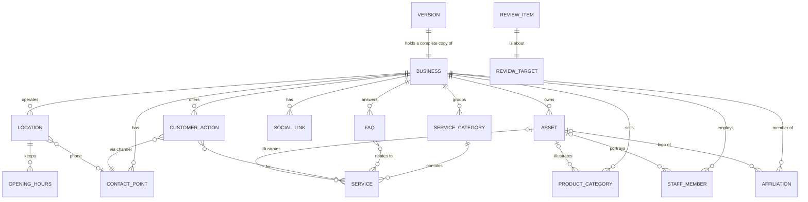

# #businessdata schema

**Status:** draft
**Depends on:** 00-architecture

## Goal

Define the fixed schema for #businessdata — profile, contact points, locations and hours,
services, products, staff, FAQs, social links, affiliations, customer actions and
assets — together with:

- a review queue of questions for the #owner, so the #owner can verify the data before
  the #site is deployed;
- snapshot versioning, so #businessdata can be rolled back consistently to an earlier
  state.

The reference example is `digest.xml`, a crawl of an existing website (Whitby Eye Care)
that is imported once to create the initial #businessdata.

## Scope

- In scope:
  - Entity–relationship model and design rules.
  - Pydantic model design (`intelliw.businessdata.schema`).
  - Referential-integrity rules.
  - Review items and review targets.
  - Hiding, soft deletion and timestamps.
  - Snapshot versioning.
  - Which images belong to #businessdata.
  - Mapping from `digest.xml`.
- Out of scope:
  - Generating the Python code.
  - The `digest.xml` importer (the mapping is specified here; the importer is not).
  - Storage: database layout, snapshot operations, resource files (03-storage).
  - Deploy behaviour, including whether open review items block deployment (later design
    document).
  - Template rendering, including how hidden entities and references to them are
    rendered (later design document).
  - GraphQL / MCP surface (02-graphql-api, 06-mcp-server).
  - #design images and slots (04-design).
  - Multi-language content.

## Specification

### Reference scenario: `digest.xml`

Whitby Eye Care ("Dr. R. Fernando & Associates") is an independent optometry clinic at
4091 Thickson Road North, Whitby, ON. The digest contains:

| Section  | Content |
| -------- | ------- |
| business | name, legal name, tagline, category, description; logo and favicon |
| contact  | main phone, general and appointment emails, external booking URL (Atlas) |
| location | one location: address, phone, map URL; weekly opening hours |
| services | 12 services in 6 categories |
| products | external store URL; 3 product categories |
| team     | 4 optometrists with role, credentials, bio, optional photo |
| faqs     | 12 question/answer pairs |
| social   | Facebook, Instagram, X, Pinterest |
| trust    | affiliation, certification, milestone, service area, brands, payment methods |
| ctas     | Book Appointment, Call Now, Reorder Contact Lenses |
| assets   | 15 images: 7 of the business itself, 8 stock or illustrative (see *Image ownership*) |

Each digest value carries `source`, `confidence` (high/medium/low) and optionally
`needs-review` with a `note` addressed to the #owner. The source site states several
facts in more than one place (the phone in contact, location and a call-to-action; the
booking and store URLs twice each), which is how its inconsistencies arose; the schema
stores each fact once and references it.

### Entity–relationship model



The diagram shows the content of one version. Every entity belongs to exactly one
version: the active version or one snapshot (see *Snapshot versioning*).

| Entity             | Key                  | Attributes |
| ------------------ | -------------------- | ---------- |
| Business           | (singleton)          | name, legal_name, tagline, category, description, logo→Asset, favicon→Asset, brands[], service_areas[], serving_since, payment_methods[] |
| ContactPoint       | id                   | kind (phone/email/booking/store/website), label, value, primary |
| Location           | id                   | name, address (street, city, region, postal_code, country), geo (lat, lng), map_url, phone→ContactPoint, hours[] |
| OpeningHours       | (location, day, seq) | open, close, closed |
| ServiceCategory    | id                   | name |
| Service            | id                   | category→ServiceCategory, name, summary, description, audience, image→Asset |
| ProductCategory    | id                   | name, description, image→Asset |
| StaffMember        | id                   | name, role, credentials, bio, languages[], photo→Asset |
| Faq                | id                   | question, answer, services→Service[] |
| SocialLink         | id                   | platform, url, label |
| Affiliation        | id                   | name, description, url, logo→Asset |
| CustomerAction     | id                   | type (book/call/email/buy/visit), label, channel→ContactPoint, services→Service[] |
| Asset              | id                   | type (logo/favicon/photo), path (under `businessdata/resources/`), alt |
| ReviewItem         | id                   | target (collection, id, field), note, status (open/resolved/dismissed), resolution |
| Version (snapshot) | number               | tag, parent, created_at; read-only |

Common attributes:

| Attribute | On | Rule |
| --- | --- | --- |
| `position` | every entity except `Business` | *Order* |
| `hidden` | contact points, locations, service categories, services, product categories, staff, FAQs, social links, affiliations, customer actions ("content entities") | *Hidden entities* |
| `deleted` | every entity except `Business` | *Soft deletion* |
| `created_at`, `updated_at` | every entity | *Timestamps* |

### Design rules

1. **Single source of truth.** Phones, emails, booking and store URLs are
   `ContactPoint`s. Anything that needs one references it by id — a location's `phone`,
   a customer action's `channel` — so changing a value in one place updates every use.
2. **Channels vs. intents.** A `ContactPoint` is a *channel* (how to reach the business).
   A `CustomerAction` is an *intent* (something a customer can do — book, call, email,
   buy, visit), carried out through a channel. Several actions can share a channel, and
   an action can be linked to the services it applies to. An action's `label` holds
   wording only; data such as the phone number comes from the channel. The first action
   (by position) is the one the #owner most wants customers to take. Button styling and
   placement are #design decisions.
3. **Store facts, not presentation.** Marketing claims are stored as the facts they
   express: an affiliation is an `Affiliation`; "serving the area since 2002" is
   `Business.serving_since`; accepted payment methods are `Business.payment_methods`;
   a certification is part of `StaffMember.credentials`; areas served are
   `Business.service_areas`; brands carried are `Business.brands`. Which facts to
   highlight, and their wording, is a #design decision.
4. **Structure over embedded strings.** Service categories are `ServiceCategory`
   entities; staff languages are `StaffMember.languages` (BCP 47 tags). Bios are free
   text and may also mention languages, credentials or dates; keeping a bio consistent
   with the structured fields is left to the agent's and the #owner's judgement.
5. **Composition is nested, association is by id.** Values that cannot exist on their
   own (address, geo, opening hours) are nested value objects. Everything else is an
   entity in a top-level collection, referenced by `id`.
6. **Ids.** Ids are slugs (`^[a-z0-9]+(-[a-z0-9]+)*$`), unique within their collection in
   a version, and immutable: an id never changes once created. To "rename", create a new
   entity and delete the old one. The same id in two versions denotes the same entity at
   two points in time.
7. **Order.** Every collection is ordered. Each entity has a `position` (0-based,
   contiguous within its collection in a version); `business.json` lists each
   collection in position order. Customer-action priority, staff order and service order
   are expressed this way.
8. **The schema is fixed in code.** The Pydantic models in `intelliw.businessdata.schema`
   are the schema: one schema for every business, with no extension points or
   owner-defined fields. It evolves only through code changes, tracked by
   `schema_version`.
9. **Markdown.** `Business.description`, `Service.description`,
   `ProductCategory.description`, `StaffMember.bio`, `Faq.answer` and
   `Affiliation.description` are CommonMark. All other text fields (names, labels,
   `tagline`, `Service.summary`, `audience`, `credentials`, `Faq.question`, alt text,
   review notes) are plain text.
10. **Hidden entities.** Content entities have `hidden: bool = False`. A hidden entity
    stays in #businessdata, keeps its id, references and review items, is returned by
    queries and can be edited; it is left out when the #site is rendered. Uses: a doctor
    on leave, a seasonal service, a contact point kept on record but not published. A
    hidden entity remains a valid reference target. `Business`, `Asset` (shown only
    through references) and `ReviewItem` (never rendered) have no `hidden` flag.
11. **Timestamps.** Every entity has `created_at` and `updated_at`: UTC, microsecond
    precision, set only by the server.
    - At import both are the import time.
    - `updated_at` advances when the entity's own fields change, including nested data
      (a day's hours → the location; languages → the staff member), `hidden` and
      `deleted`. Adding or removing a many-to-many link advances the entity that owns
      the list (`Faq.services` → the FAQ; `CustomerAction.services` → the action).
    - Moving or reordering does not advance `updated_at`.
    - Timestamps are part of the export, so load → save is lossless.
12. **Soft deletion.** Every entity except `Business` has `deleted: bool = False`.
    Deleting sets the flag; the entity is then marked to be permanently deleted by a
    separate admin tool (the purge), which is not part of the GraphQL API.
    - A deleted entity is treated as non-existent by queries, references, rendering and
      review targets, and cannot be edited.
    - Until purged, it can be restored in the active version (02-graphql-api, *Restore*).
    - Its id remains taken until purged; a new entity cannot reuse it.
    - At deletion, references to it are cleared, many-to-many links to it are removed,
      deletion is refused while it is still in use (02-graphql-api, *Delete behaviour*),
      and open review items about it are dismissed. No non-deleted entity ever refers to a
      deleted one.
    - Deleted entities are part of the export.
13. **Review items.** #businessdata stores no extraction metadata (no source or
    confidence). What the #owner needs to check or decide is recorded as `ReviewItem`s,
    each pointing at a *review target* (see *Review targets*). How open review items
    affect deployment is defined in a later design document.
14. **Validation.** The `BusinessData` model validator checks a whole document
    (import, export round trip). Changes made through the API are validated per
    mutation (02-graphql-api, *Validation*) against the same rules.

### Snapshot versioning

#businessdata consists of:

- **the active version** — the single editable copy. Every change (create, update,
  delete, restore, reorder, review status) happens here, and the #site is rendered from
  it;
- **snapshots** — numbered, **read-only** copies of the active version. A snapshot is
  never changed, so it always holds exactly the state in which it was taken.

A snapshot is complete: the business, every collection (including hidden and deleted
entities) and every review item.

| Snapshot attribute | Meaning |
| ------------------ | ------- |
| `number`           | 1, 2, 3, ... in creation order; never reused |
| `tag`              | optional name (e.g. `reviewed-2026-09`); unique within the workspace; 1–100 characters, no leading or trailing whitespace |
| `parent`           | the snapshot the active version was based on when this one was taken; `None` for snapshot 1 |
| `created_at`       | when the snapshot was taken |

The active version is *based on* one snapshot — the one it was last snapshotted to or
activated from — and is *modified* if it has changed since.

- **Taking a snapshot** copies the active version into a new snapshot with the next
  number and an optional tag. The active version is then based on the new snapshot and
  not modified. The copy is exact: ids, field values, positions, `hidden` and `deleted`
  flags, and `created_at` / `updated_at`.
- **Activating a snapshot (rollback)** replaces the content of the active version with an
  exact copy of the snapshot, timestamps included. If the active version is modified, it
  is first snapshotted automatically (untagged), so no change is ever lost. No snapshot
  is changed or deleted.
- **Import** creates snapshot 1 and an active version based on it.
- **Everything in a snapshot is frozen**, including review items and deleted entities.
  Restoring and the purge act on the active version only.
- **Files are immutable.** Asset records are versioned, but the files under
  `businessdata/resources/` are shared by the active version and all snapshots. A file
  must never be overwritten or removed while the active version or any snapshot refers
  to it: uploading always creates a new path, and replacing a photo means registering the
  new file and updating the asset's `path`. This is a requirement on the web interface
  that manages resources and on the purge admin tool.
- **#design is not versioned with #businessdata.** #design slot bindings to entities
  that do not exist in the active version are ignored at render time (04-design).
- **Version is context, not content.** Entities carry no version field; a
  `BusinessData` document states which version it is. References never cross versions.
  Any representation outside a document (API results, storage rows) adds the version.

### Image ownership

An image belongs to #businessdata if it is a picture of this business — its brand marks,
people, premises, equipment or products — and would stay correct under any #design. Such
images are `Asset`s with files under `businessdata/resources/`, referenced from entities
(`Business.logo`, `StaffMember.photo`, `Service.image`, ...).

Stock photos, generic illustrations, banners and backgrounds belong to #design
(`design/assets/`) and are placed through #design image slots (04-design). When an
entity has both, templates prefer the #businessdata image.

The digest's images (classified from file names and alt text):

| Asset                     | File                           | Goes to       | Used by |
| ------------------------- | ------------------------------ | ------------- | ------- |
| `logo`                    | `logo.png`                     | #businessdata | `Business.logo` |
| `favicon`                 | `fav_icon.png`                 | #businessdata | `Business.favicon` |
| `dr-raniero-fernando`     | `Dr-Raniero-Fernando.jpg`      | #businessdata | Dr. Fernando's `StaffMember.photo` |
| `dr-sumeya-mao`           | `dr-Sumeya.png`                | #businessdata | Dr. Mao's `StaffMember.photo` |
| `dry-eye-device`          | `unnamed.png`                  | #businessdata | Dry Eye Testing's `Service.image` |
| `blephex-device`          | `banner2.png`                  | #businessdata | BlephEx Treatment's `Service.image` |
| `about-clinic`            | `about-img.jpg`                | #businessdata, pending review | #design `about` slot |
| `hero-family-sunglasses`  | `iStock-947926156-1600x700.jpg`| #design       | `hero` slot |
| `adult-senior-exam`       | `adult.jpg`                    | #design       | service illustration: `adult-senior-eye-exams` |
| `childrens-exam`          | `children_exam.jpg`            | #design       | service illustration: `children-eye-exams` |
| `occupational-eye-exams`  | `MTO_and_police_eye_exams.jpg` | #design       | service illustration: `mto-and-police-eye-exams` |
| `contact-lens-fitting`    | `lens_fitting.jpg`             | #design       | service illustration: `contact-lens-fitting` |
| `computer-eye-strain`     | `computer_banner.jpg`          | #design       | service illustration: `computer-related-eye-strain` |
| `contact-lenses-product`  | `Contact-Lences.jpg`           | #design       | product-category illustration: `contact-lenses` |
| `sunglasses-product`      | `SunGlasses.jpg`               | #design       | product-category illustration: `sunglasses` |

`about-clinic` gets a review item asking whether it shows the real practice; if it is
stock, it moves to `design/assets/` and the `about` slot is rebound there.

### Review targets

A review item's `target` names what it is about:

- `collection` — the entity's top-level collection (`business`, `contacts`, `locations`,
  `service_categories`, `services`, `product_categories`, `staff`, `faqs`,
  `social_links`, `affiliations`, `actions`, `assets`).
- `id` — the entity's id; omitted for `business`.
- `field` — optionally one attribute, by its GraphQL (camelCase) name, e.g. `legalName`,
  `mapUrl`; omitted when the question is about the whole entity.

Targets use ids, not positions, so they survive reordering. Knowing the target, the
system can show the current value beside the question, offer to resolve the item when
the #owner edits the target, and dismiss the item when the target is deleted.

### Pydantic model design

Module `intelliw.businessdata.schema`, pydantic v2. Intended shape, not final code.

```python
from datetime import datetime, time
from enum import StrEnum
from typing import Annotated, Literal
from pydantic import BaseModel, ConfigDict, Field, HttpUrl, model_validator

Slug = Annotated[str, Field(pattern=r"^[a-z0-9]+(-[a-z0-9]+)*$")]
Markdown = str   # CommonMark (rule 9)


class Model(BaseModel):
    model_config = ConfigDict(extra="forbid")


class Timestamped(Model):
    created_at: datetime              # UTC; server-set (rule 11)
    updated_at: datetime              # UTC; server-set (rule 11)


class Entity(Timestamped):
    id: Slug                          # immutable; unique per collection per version (rule 6)
    position: int                     # 0-based, contiguous per collection (rule 7)
    deleted: bool = False             # marked for purge (rule 12)


class Hideable(Entity):
    hidden: bool = False              # not rendered (rule 10)


# ---- enums -----------------------------------------------------------------

class ContactKind(StrEnum):
    phone = "phone"; email = "email"; booking = "booking"; store = "store"; website = "website"

class Weekday(StrEnum):
    monday = "monday"; tuesday = "tuesday"; wednesday = "wednesday"; thursday = "thursday"
    friday = "friday"; saturday = "saturday"; sunday = "sunday"

class PaymentMethod(StrEnum):
    cash = "cash"; credit = "credit"; debit = "debit"; cheque = "cheque"
    e_transfer = "e_transfer"; direct_billing = "direct_billing"

class ActionType(StrEnum):
    book = "book"; call = "call"; email = "email"; buy = "buy"; visit = "visit"

class AssetType(StrEnum):
    logo = "logo"; favicon = "favicon"; photo = "photo"

class SocialPlatform(StrEnum):
    facebook = "facebook"; instagram = "instagram"; x = "x"; pinterest = "pinterest"
    linkedin = "linkedin"; youtube = "youtube"; tiktok = "tiktok"

class ReviewStatus(StrEnum):
    open = "open"; resolved = "resolved"; dismissed = "dismissed"

# Enum values contain no hyphens, so they are valid GraphQL enum names as-is.


# ---- value objects (nested) ------------------------------------------------

class Address(Model):
    street: str
    city: str
    region: str               # ISO 3166-2 subdivision, e.g. "ON"
    postal_code: str
    country: str = "CA"       # ISO 3166-1 alpha-2

class GeoPoint(Model):
    lat: float
    lng: float

class OpeningHours(Model):
    day: Weekday
    seq: int = 0              # interval number within the day (split shifts)
    open: time | None = None
    close: time | None = None
    closed: bool = False
    # validator: closed XOR (open and close); open < close
    # validator (on Location): (day, seq) unique; no overlapping intervals per day


# ---- entities --------------------------------------------------------------

class Business(Timestamped):
    name: str
    legal_name: str | None = None
    tagline: str = ""
    category: str = ""
    description: Markdown = ""
    logo: Slug | None = None          # -> Asset.id (type logo)
    favicon: Slug | None = None       # -> Asset.id (type favicon)
    brands: list[str] = []
    service_areas: list[str] = []
    serving_since: int | None = None  # year
    payment_methods: list[PaymentMethod] = []

class ContactPoint(Hideable):
    kind: ContactKind
    label: str = ""
    value: str                        # phone number, email address or URL (validated per kind)
    primary: bool = False             # at most one primary non-deleted per kind

class Location(Hideable):
    name: str
    address: Address
    geo: GeoPoint | None = None
    map_url: HttpUrl | None = None
    phone: Slug | None = None         # -> ContactPoint.id (kind phone)
    hours: list[OpeningHours] = []

class ServiceCategory(Hideable):
    name: str

class Service(Hideable):
    category: Slug                    # -> ServiceCategory.id
    name: str
    summary: str = ""
    description: Markdown = ""
    audience: str | None = None
    image: Slug | None = None         # -> Asset.id; a picture of the business (Image ownership)

class ProductCategory(Hideable):
    name: str
    description: Markdown = ""
    image: Slug | None = None         # -> Asset.id; a picture of products carried

class StaffMember(Hideable):
    name: str
    role: str
    credentials: str = ""
    bio: Markdown = ""
    languages: list[str] = []         # BCP 47 tags, e.g. ["en", "yue", "ur", "hi"]
    photo: Slug | None = None         # -> Asset.id

class Faq(Hideable):
    question: str
    answer: Markdown
    services: list[Slug] = []         # -> Service.id

class SocialLink(Hideable):
    platform: SocialPlatform
    url: HttpUrl
    label: str = ""

class Affiliation(Hideable):
    name: str
    description: Markdown = ""
    url: HttpUrl | None = None
    logo: Slug | None = None          # -> Asset.id

class CustomerAction(Hideable):
    type: ActionType
    label: str                        # wording only, e.g. "Book Appointment"
    channel: Slug                     # -> ContactPoint.id; href derived (tel:, mailto:, URL)
    services: list[Slug] = []         # -> Service.id

class Asset(Entity):
    type: AssetType
    path: str                         # relative to businessdata/resources/; file is immutable
    alt: str = ""


# ---- review -----------------------------------------------------------------

Collection = Literal[
    "business", "contacts", "locations", "service_categories", "services",
    "product_categories", "staff", "faqs", "social_links", "affiliations",
    "actions", "assets",
]

class ReviewTarget(Model):
    collection: Collection
    id: Slug | None = None            # None only for collection == "business"
    field: str | None = None          # GraphQL (camelCase) field name; None = whole entity

class ReviewItem(Entity):
    target: ReviewTarget
    note: str                         # addressed to the #owner, plain text
    status: ReviewStatus = ReviewStatus.open
    resolution: str | None = None


# ---- versions ---------------------------------------------------------------

class Version(Model):                 # a read-only snapshot
    number: int                       # 1, 2, 3, ...; never reused
    tag: str | None = None            # unique within the workspace
    parent: int | None = None         # snapshot the active version was based on; None for 1
    created_at: datetime


class VersionIndex(Model):            # workspace-level; not part of any version
    based_on: int                     # -> Version.number
    modified: bool                    # active version changed since `based_on`
    snapshots: list[Version]


# ---- root document (business.json): the content of one version -----------

class BusinessData(Model):
    schema_version: str = "1"
    snapshot: Version | None = None   # the snapshot this document is; None = active version
    business: Business
    contacts: list[ContactPoint] = []
    locations: list[Location] = []
    service_categories: list[ServiceCategory] = []
    services: list[Service] = []
    product_categories: list[ProductCategory] = []
    staff: list[StaffMember] = []
    faqs: list[Faq] = []
    social_links: list[SocialLink] = []
    affiliations: list[Affiliation] = []
    actions: list[CustomerAction] = []
    assets: list[Asset] = []
    reviews: list[ReviewItem] = []

    @model_validator(mode="after")
    def _check_integrity(self) -> "BusinessData":
        # - ids unique within each collection, counting deleted entities
        # - positions 0..n-1 within each collection, lists in position order
        # - every reference resolves to an existing, non-deleted entity of the right
        #   collection/kind: logo/favicon/image/photo/affiliation logo -> assets
        #   (logo -> type logo, favicon -> type favicon); category -> service_categories;
        #   Location.phone -> contacts (kind phone); CustomerAction.channel -> contacts;
        #   Faq.services, CustomerAction.services -> services
        # - CustomerAction.type fits its channel's kind
        #   (call -> phone, email -> email, book -> booking/phone, buy -> store, visit -> website)
        # - every ReviewItem.target resolves: id present iff collection != "business",
        #   id exists in collection, field (if set) is a field of that entity;
        #   open review items never target deleted entities
        # - at most one primary non-deleted ContactPoint per kind
        ...
```

Example fragment of `business.json` (abridged): the active version, based on snapshot 1.
The data was imported on 2026-09-24 at 14:05:12 UTC; the next day the #owner resolved the
booking-system review, so only that review's `updated_at` differs.

```json
{
  "schema_version": "1",
  "snapshot": null,
  "business": {
    "name": "Whitby Eye Care",
    "legal_name": "Whitby Eye Care - Dr. R. Fernando & Associates",
    "logo": "logo",
    "service_areas": ["Whitby", "Oshawa", "Ajax", "Pickering", "Scarborough"],
    "serving_since": 2002,
    "payment_methods": ["cash", "credit", "debit"],
    "created_at": "2026-09-24T14:05:12.000000Z",
    "updated_at": "2026-09-24T14:05:12.000000Z"
  },
  "affiliations": [
    {"id": "optometric-services-inc", "position": 0, "name": "Optometric Services Inc.",
     "description": "Canada's largest network of optometrists ...",
     "hidden": false, "deleted": false,
     "created_at": "2026-09-24T14:05:12.000000Z", "updated_at": "2026-09-24T14:05:12.000000Z"}
  ],
  "contacts": [
    {"id": "main-phone", "position": 0, "kind": "phone", "label": "Main", "value": "905-655-6236", "primary": true,
     "hidden": false, "deleted": false,
     "created_at": "2026-09-24T14:05:12.000000Z", "updated_at": "2026-09-24T14:05:12.000000Z"},
    {"id": "booking", "position": 1, "kind": "booking", "value": "https://atlas.opto.com/v1/Router/8090/bookAppointment/?lang=En",
     "hidden": false, "deleted": false,
     "created_at": "2026-09-24T14:05:12.000000Z", "updated_at": "2026-09-24T14:05:12.000000Z"},
    {"id": "store", "position": 2, "kind": "store", "value": "https://whitbyeyecare.ottooptics.io/reorder/product/",
     "hidden": false, "deleted": false,
     "created_at": "2026-09-24T14:05:12.000000Z", "updated_at": "2026-09-24T14:05:12.000000Z"}
  ],
  "actions": [
    {"id": "book-appointment", "position": 0, "type": "book", "label": "Book Appointment", "channel": "booking",
     "hidden": false, "deleted": false,
     "created_at": "2026-09-24T14:05:12.000000Z", "updated_at": "2026-09-24T14:05:12.000000Z"},
    {"id": "call-clinic", "position": 1, "type": "call", "label": "Call Now", "channel": "main-phone",
     "hidden": false, "deleted": false,
     "created_at": "2026-09-24T14:05:12.000000Z", "updated_at": "2026-09-24T14:05:12.000000Z"},
    {"id": "reorder-contact-lenses", "position": 2, "type": "buy", "label": "Reorder Contact Lenses", "channel": "store",
     "hidden": false, "deleted": false,
     "created_at": "2026-09-24T14:05:12.000000Z", "updated_at": "2026-09-24T14:05:12.000000Z"}
  ],
  "reviews": [
    {"id": "booking-system", "position": 0,
     "target": {"collection": "contacts", "id": "booking", "field": "value"},
     "note": "Your site has two different ways to book ... Please confirm which booking system you want patients to use.",
     "status": "resolved", "resolution": "Keep Atlas; the JotForm page will be removed.", "deleted": false,
     "created_at": "2026-09-24T14:05:12.000000Z", "updated_at": "2026-09-25T09:31:47.218004Z"},
    {"id": "prescription-eyewear", "position": 1,
     "target": {"collection": "services", "id": "prescription-eyewear"},
     "note": "We were less sure about this service than the others ... Please check it is described correctly.",
     "status": "open", "deleted": false,
     "created_at": "2026-09-24T14:05:12.000000Z", "updated_at": "2026-09-24T14:05:12.000000Z"}
  ]
}
```

### Mapping from `digest.xml`

| digest element                          | #businessdata |
| --------------------------------------- | ------------- |
| `business/*`                            | `business.*` |
| `brand/logo`, `brand/favicon`           | `business.logo`, `business.favicon` |
| `contact/phone`, `email`, `booking-url` | `contacts[]` (kind phone/email/booking) |
| `products/store-url`                    | `contacts[]` (kind store) |
| `locations/location`                    | `locations[]`; `phone` references the main phone contact point |
| `hours/day`                             | the location's `hours[]` (`seq` 0) |
| `services/service/@category`            | `service_categories[]` (deduplicated) + `services[].category` |
| `products/category`                     | `product_categories[]` |
| `team/member`                           | `staff[]`; languages extracted from the bio |
| `trust/item[@kind=service-area]`        | `business.service_areas` |
| `trust/item[@kind=brands]`              | `business.brands` |
| `trust/item[@kind=affiliation]`         | `affiliations[]` |
| `trust/item[@kind=milestone]`           | `business.serving_since` (year parsed from the label) |
| `trust/item[@kind=payment]`             | `business.payment_methods` |
| `trust/item[@kind=certification]`       | `staff[].credentials` |
| `ctas/cta`                              | `actions[]` in digest order; `@href` resolved to a `channel`; `@kind` not stored; phone number not included in `label` |
| `assets/asset`                          | per *Image ownership*: pictures of the business → `assets[]` + `businessdata/resources/`; others → `design/assets/` + a #design slot binding |
| `@source`                               | not stored |
| `@needs-review` + `@note`               | `reviews[]` (open) |
| `@confidence` = low / medium            | `reviews[]` (open), merged with the element's `@needs-review` note if present, otherwise with a generated note |
| `@confidence` = high / absent           | not stored |

Document order in the digest gives each collection's positions. For Whitby Eye Care the
import yields 10 open review items:

| Review item                      | collection  | id                     | field       |
| -------------------------------- | ----------- | ---------------------- | ----------- |
| official business name           | `business`  | —                      | `legalName` |
| appointment email                | `contacts`  | `appointments-email`   | `value`     |
| booking system                   | `contacts`  | `booking`              | `value`     |
| map pin                          | `locations` | `whitby`               | `mapUrl`    |
| opening hours                    | `locations` | `whitby`               | `hours`     |
| Dr. Chan photo                   | `staff`     | `dr-andrea-chan`       | `photo`     |
| Dr. Naeem photo / Dr. Peter Chan | `staff`     | `dr-hajra-naeem`       | —           |
| designer frame brands            | `business`  | —                      | `brands`    |
| Prescription Eyewear (medium confidence) | `services` | `prescription-eyewear` | — |
| is the "about" photo real?       | `assets`    | `about-clinic`         | —           |

Import creates snapshot 1 and an active version based on it, with every timestamp set
to the import time.

## Acceptance criteria

- [ ] `BusinessData` validates the Whitby Eye Care example converted from `digest.xml`.
- [ ] Duplicate ids within a collection are rejected, counting deleted entities.
- [ ] Positions within each collection are 0..n-1 and lists are in position order.
- [ ] Dangling references (asset, category, contact point, service, review target) are rejected.
- [ ] A reference to a deleted entity is rejected.
- [ ] `Business.logo` / `favicon` referring to an asset of another type is rejected.
- [ ] Opening hours with `closed` and times both set, `open >= close`, a duplicate
      (day, seq) or overlapping intervals are rejected.
- [ ] A `CustomerAction` href is derivable from its channel (`tel:`, `mailto:`, URL).
- [ ] A `CustomerAction` whose type does not fit its channel's kind is rejected.
- [ ] Two primary non-deleted contact points of the same kind are rejected.
- [ ] Load → save of `business.json` is lossless.
- [ ] The digest yields the 10 open `ReviewItem`s listed above.
- [ ] Only pictures of the business are imported into `businessdata/resources/`; the 8
      stock/illustrative digest images go to `design/assets/`.
- [ ] No source or confidence is stored in `business.json`.
- [ ] Changing an entity's id is rejected.
- [ ] Content entities have `hidden` (default `false`); `Business`, `Asset` and
      `ReviewItem` do not.
- [ ] Every entity has `created_at` and `updated_at`; import sets both to the import time.
- [ ] Changing an entity's field, nested data, `hidden` or `deleted` advances its
      `updated_at`; moving it does not.
- [ ] Every entity except `Business` has `deleted` (default `false`); no non-deleted
      entity references a deleted one, and no open review item targets one.
- [ ] A deleted entity's id cannot be reused by a new entity.
- [ ] Import creates snapshot 1 and an active version based on it.
- [ ] No operation changes a snapshot's content.
- [ ] A snapshot is an exact copy of the active version, including hidden and deleted
      entities, review items, positions and timestamps.
- [ ] Activating a snapshot makes the active version an exact copy of it; if the active
      version was modified, it is snapshotted first.
- [ ] Snapshot numbers are never reused; tags are unique within the workspace.
- [ ] Every file under `businessdata/resources/` referred to by the active version or any
      snapshot exists and is unchanged.

## Implementation notes

Implemented (Task 2, storage and read access) in `src/intelliw/businessdata/`; storage is described in 03-storage:

| Module | Contents |
| --- | --- |
| `schema.py` | Pydantic models as specified, `integrity_errors()` (the document validator), `COLLECTIONS` registry |
| `tables.py` | SQLAlchemy tables; row attributes mirror the Pydantic fields so `Model.model_validate(row)` converts a row |
| `database.py` | SQLite engine (foreign keys on), `init_db`, sessions |
| `queries.py` | read access returning schema models (see 02-graphql-api) |
| `documents.py` | `write_version` / `read_version` (document ↔ database), `initialize` (snapshot 1 + active version) |

Differences from the sketch above:

- Timestamps are `UtcDatetime` (a `datetime` that must be timezone-aware, normalized to
  UTC) rather than plain `datetime`, so they map to GraphQL's `DateTime` scalar.
- `ReviewTarget` is an alias of `EntityRef`, which is also used for query results
  (asset usage, trash). `Collection` includes `reviews` for those results; a review item
  cannot target a review item.
- `TrashItem` (a query result) is defined in `schema.py`.
- The active version is stored as version `0`; snapshots are `1, 2, ...`.

Tests: `tests/test_businessdata_schema.py`, `tests/test_businessdata_db.py` (sample document
in `tests/businessdata_sample.py`).

Snapshots and rollback are implemented (03-storage). Not yet implemented: a general
`digest.xml` importer (a one-off script exists, `examples/import_whitby_digest.py`) and
mutations.
